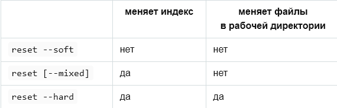

 [НА ГЛАВНУЮ](./readme.md "Вернуться на главную страницу")

## Отмена изменений. Удаление коммитов

---

В этой главе вы узнаете о различных стратегиях для выполнения отмены изменений, получите необходимые навыки для работы с предыдущими версиями проекта. Также узнаете о режимах команды `git reset`

### Жесткий reset --hard

`git reset --hard` используют для полной отмены последних коммитов и для удаления незакоммиченных изменений.

`git reset --hard` - отменить все незакоммиченные ненужные изменения в текущей ветке;
  
`git reset --hard <хэш коммита>` - передвигает текущую ветку на указанный коммит и **обновляет рабочую директорию вместе с индексом на состояние указанного коммита**.

### Мягкий reset --soft

`git reset --soft <хэш коммита>` используют для исправления последнего коммита (или даже нескольких). 

`git reset --soft <хэш коммита>` - передвигает текущую ветку на указанный коммит, а **рабочую директорию и индекс не трогает**. Когда мы переходим на новую ветку появляются незакоммиченные изменения.  
**!** Теперь этот коммит - вершина (*HEAD*) и дальнейшие коммиты и ветки пойдут от нее, а старый коммит вскоре будет удален.

`git commit -c <хэш коммита>` - используют когда для нового коммита нужно взять информацию об авторе из существующего коммита.  
* если  указать **-c** - описание можно будет подправить
* если указать **-С** - без редактирования описания

### Режим по умолчанию reset -- mixed 

Cмешанный `git reset --mixed` или просто `git reset` (*режим по умолчанию*).  
(*флаг **--mixed** можно не указывать, но в этой главе мы будем указывать для наглядности*)

`git reset --mixed <имя_файла>` - убрать файл из индекса, при этом файл останется в рабочей директории;

`git reset --mixed <хэш_коммита>` - передвигает текущую ветку на <*указанный коммит*>, **обновляет индекс на новое состояние, а рабочую директорию не трогает**.

`git reset --mixed HEAD` - используют для сброса индекса на состояние указанного в текущем коммите (очистка индекса от всех изменений), при этом изменения останутся в текущей директории. (***Антипод*** команды `git add .`)

`git reset --mixed HEAD <имя_файла или папки>` - сбрасывает изменения каталога для файла или папки (отменить добавление в репозиторий);

#### Таблица. Сравнение режимов команды reset.  

### Еще несколько полезных команд для отмены и удаления

`git restore --staged <имя файла>` - убрать из индекса определенный файл;

`git checkout <хэш_коммита> <имя файла>` - убрать все текущие изменения в файле в рабочей директории и ***загрузить версию файла из текущего коммита***;

`git checkout <имя файла>` - убрать все текущие изменения в файле в рабочей директории и ***загрузить версию файла из индекса*** (!не указываем коммит);

`git checkout -f` - используют для отмены всех незакоммиченных ненужных изменений в текущей ветке;

`git clean -dxf` - используют для удаление всех неотслеживаемых "лишних" файлов и папок, 
включая файлы из ***.gitignore***;

`git commit --amend` - исправление последнего коммита. Передвигает текущую ветку назад, а затем создает из текущего индекса новый коммит.  
*Как команда `reset --soft` при этом все файлы в рабочей директории и в индексе остались как есть, откатилась только ссылка в репозитории*.

`git reset --soft` и `git commit --amend` могут помочь **только с последними коммитами ветки**. Не могут помочь с изменениями коммита, которые находятся где то в других ветках.  
*Такая задача реализуется через переписывание ветки, начиная от изменяемого коммита, используя `git rebase`*

*Про команду `git revert` и не только вы узнате в следующей главе 
[работа с удаленным репозитроием](./remotely_repository.md)*

---

пред | | след 

---

cancel logo by *[Bitsies](http://www.recepkutuk.com)*, 
license: *[CC BY 4.0](https://creativecommons.org/licenses/by/4.0/)*

Arrows right and left by *[Tatice](http://tatice.deviantart.com)*, 
license: *[CC BY 4.0](https://creativecommons.org/licenses/by/4.0/)*

Home icon by *[Double-J Design](http://www.doublejdesign.co.uk)*, 
license: *[CC BY 4.0](https://creativecommons.org/licenses/by/4.0/)*

Инструкция по работе с GIT  
***[Anatoly Kostrykin](https://github.com/Anatoly-web-dev)***, **2022**